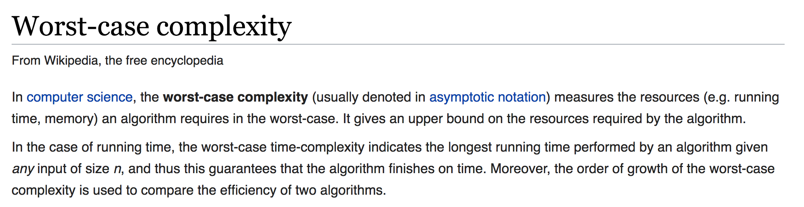

## Best Case, Average Case and Worst Case

### Objectives

* Understand why we choose the worst case scenario
* Understand how to calculate the worst case scenario

### Introduction

So in the last section, we said that we express the **time complexity** of a function in terms of the length of the input.  But we also, noted that time it takes our algorithm changes depends on whether or not there is a matching letter, and the position of that matching letter.  

```javascript
  function stringIncludes(word, letter){
    let matches;
    for(let i = 0; i < word.length; i++){
      if(word[i] === letter){
        matches = true
      }
    }
    return !!matches
  }

  stringIncludes("banana", "b")
  // true
  stringIncludes(fruit, "d")
  // false
```


So the cost of answering whether a "b" is in "banana" on has a cost of 3, in our above function.  While it appears that the letter d is not in the string has a cost of nine (n + 3).  We call scenarios where the shortest amount of time is taken the **best case**, and times where the most amount of time is taken the **worst case**. 

So should we choose the best case scenario, worst case scenario, or perhaps the average case when considering the performance of our function.  

### Best, Average, worst?  Always Choose worst.


1. **Best Case** The best case scenario for our function, is to ask the question whether "b" is in the word "banana".  That is, the smallest amount of steps our function can perform is three, and that's the amount it performs in this case.  Now that we know this fact, let's just say that we never care about the best case scenario.
	
	Why, well, the best case of scenario of calculating anything for a computer is the same: fast enough that performance is not an issue.  For example, imagine we change our function to the following:
	
	```javascript
		let fruit = "banana"
		let letter = "b"
		function stringIncludes(fruit, letter){
	      alert('ask a six year old child if the letter b includes banana')
	    }
	```
Assuming one is sitting next to you, our function would still be pretty performant.  In other words, it doesn't make too much sense to optimize over two functions' best case, because both will take the same amount of time: very little.  

2. **Average Case** When evaluating the performance of algorithms, we generally do not consider the average case either.  Why?  Well, its often difficult to determine that average.  

	For example, to calculate the average scenario for our includes method we may need to consider all of the words in English, and then all of the letters in the alphabet and see how our function performs with each.  But maybe we should also consider the popularity of those words - how likely is our function to receive each word and letter as an argument.  So we may get the average case wrong and if we optimize for the wrong case, then our algorithm can may end up taking a long time.  In summary, it's hard to calculate the average case, so when coding we generally don't consider it.

3. **worst Case** hits the spot. 


So we didn't choose the best case because virtually all algorithms look good when you consider the best case.  And we didn't choose the average case because it can be difficult to calculate the average case.  The worst case scenario can be calculated without looking at streams of data.  And we also consider the worst case, because that is a scenario where it matters - we feel the pain in a worst case scenario.  Even if on average our website is good, if every 30 times our website takes a long time to load, our users become a little sadder.  So when evaluating how long it takes consider the worst case scenario.  Worst case scenario:

  * given an input of a specific size, consider an input that someone who wants our procedure to take as long as possible would choose

Or, from Wikipedia: 



The worst our function could ever perform on the string "banana" is nine.  It must go through every letter, and three other operations.

  ```javascript
  function stringIncludes(fruit, letter){
    let matches;
    for(let i = 0; i < fruit.length; i++){
      if(fruit[i] === letter){
        matches = true
      }
    }
    return !!matches
  }

  stringIncludes("banana", "d")
  ```


### Summary

Thus far, we have said that time complexity means the number of lines of code run in the worst case scenario, where the worst case scenario is one where given an input of a certain size, our function takes as long as possible.  

We can express the worst case scenario in terms of the size of the input.  So with our `includes` function, the worst case is when we have to go through every letter of the string, and then add three.  If we call the length of our input n, then we would say that the cost of our function is
  n + 2

Alright, so we are almost finished with our discussion of time complexity.  We'll finish it up in the next section.